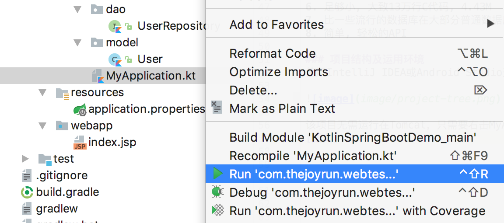
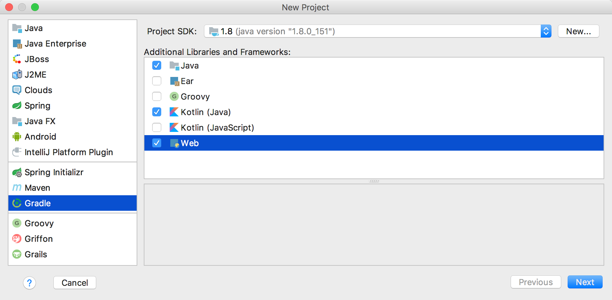
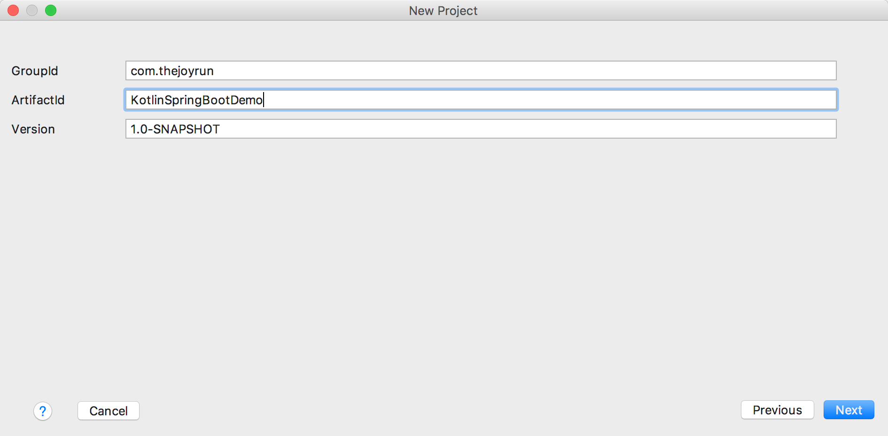
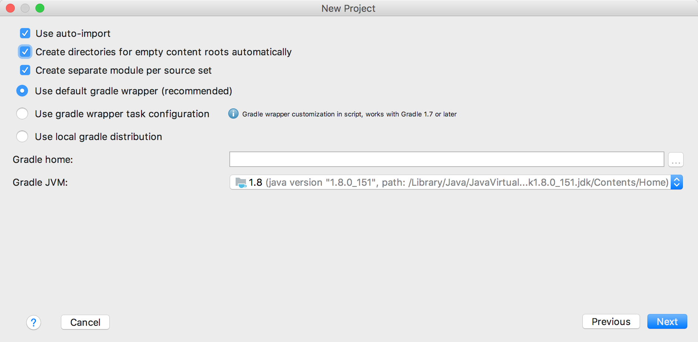

# 《Gradle+Kotlin结合Spring Boot+Mybatis+SQLite快速开发轻量级服务器应用教程》

标题想了很多，感觉很多的标题都合适，比如:

《Kotlin + Spring Boot会不会成为一种新的选择？》

《写给Android工程师的服务端开发架构》

《打造轻量级的Java服务器框架，无需部署Tomcat，也无需部署Mysql》

《gradle + kotlin + spring boot + mybatis + sqlite 服务端开发》


### 前言
我一直以来都是使用Maven+Java+Tomcat+Springmvc+Mybatis+Mysql来搭建小型服务器应用，这套框架很简单，也方便易用，最近我在想会不会有更好的解决方案，加上最近在学习了Kotlin语言开发Android，所以就有了这篇文章。


### 框架介绍
该架构使用Gradle+Kotlin+Spring Boot+Mybatis+SQLite来代替Maven+Java+Tomcat+Springmvc+Mybatis+Mysql，其中Gradle代替Maven，Kotlin代替Java，Spring Boot 代替 Tomcat，同时Spring也自带了Springmvc，SQLite代替Mysql。
##### Kotlin
Kotlin 是一个用于现代多平台应用的静态编程语言，由 JetBrains 开发。可以编译成Java字节码，也可以编译成JavaScript，方便在没有JVM的设备上运行。
Kotlin已正式成为Android官方支持开发语言。
##### Gradle
Gradle是一个基于Apache Ant和Apache Maven概念的项目自动化构建工具。它使用一种基于Groovy的特定领域语言(DSL)来声明项目设置，抛弃了基于XML的各种繁琐配置。基于Groovy，build脚本使用Groovy编写。

##### Spring Boot
Spring Boot是由Pivotal团队提供的全新框架，其设计目的是用来简化新Spring应用的初始搭建以及开发过程。通过这种方式，Spring Boot致力于在蓬勃发展的快速应用开发领域(rapid application development)成为领导者。
1. 创建独立的Spring应用程序
2. 嵌入的Tomcat，无需部署WAR文件
3. 简化Maven配置
4. 自动配置Spring
5. 提供生产就绪型功能，如指标，健康检查和外部配置
6. 绝对没有代码生成和对XML没有要求配置

##### Mybatis
MyBatis 是一款优秀的持久层框架，它支持定制化 SQL、存储过程以及高级映射。MyBatis 避免了几乎所有的 JDBC 代码和手动设置参数以及获取结果集。
##### SQLite
SQLite，是一款轻型的数据库，是遵守ACID的关系型数据库管理系统。不像常见的客户-服务器范例，SQLite引擎不是个程序与之通信的独立进程。整个数据库(定义、表、索引和数据本身)都在宿主主机上存储在一个单一的文件中。
1. ACID事务
2. 零配置 – 无需安装和管理配置
3. 储存在单一磁盘文件中的一个完整的数据库
4. 数据库文件可以在不同字节顺序的机器间自由的共享
5. 支持数据库大小至2TB
6. 足够小, 大致13万行C代码, 4.43M
7. 比一些流行的数据库在大部分普通数据库操作要快
8. 简单, 轻松的API

### 项目结构及运用环境
使用IntelliJ IDEA或Android Studio开发运行，该项目的文件结构如下：
```$xslt

├── build.gradle
├── gradle
├── mydatabase.sqlite
├── settings.gradle
└── src
    ├── main
    │   ├── java
    │   ├── kotlin
    │   │   └── com
    │   │       └── thejoyrun
    │   │           └── webtest
    │   │               ├── MyApplication.kt
    │   │               ├── controller
    │   │               │   ├── TestApiController.kt
    │   │               │   └── TestController.kt
    │   │               ├── dao
    │   │               │   └── UserRepository.kt
    │   │               └── model
    │   │                   └── User.kt
    │   ├── resources
    │   │   └── application.properties
    │   └── webapp
    │       └── index.jsp
    └── test
        ├── java
        ├── kotlin
        └── resources

```

由于SQLite需要写绝对的文件路径，所以需要配置SQLite路径，application.properties文件的spring.datasource.url字段。

项目无需运行在Tomcat,项目的MyApplication.kt有main函数入口，只需要右击MyApplication.kt，选择`run 'com.thejoyrun.webtest.MyApplicationKt'`运行即可。



### 使用IntelliJ IDEA创建项目过程
##### 创建Kotlin的web项目
流程1

流程2

流程3



##### 配置build.gradle文件
增加Spring Boot、Mybatis、SQLite支持

```groovy
group 'com.thejoyrun'
version '1.0-SNAPSHOT'
buildscript {
    ext.kotlin_version = '1.1.2'
    ext.springBootVersion = '2.0.1.RELEASE'
    repositories {
        mavenCentral()
    }
    dependencies {
        // Kotlin
        classpath "org.jetbrains.kotlin:kotlin-gradle-plugin:$kotlin_version"
        // Spring-boot
        classpath "org.springframework.boot:spring-boot-gradle-plugin:$springBootVersion"
    }
}
apply plugin: 'java'
apply plugin: 'kotlin'
apply plugin: 'war'
sourceCompatibility = 1.8
repositories {
    mavenCentral()
}
dependencies {
    testCompile group: 'junit', name: 'junit', version: '4.11'
    testCompile group: 'junit', name: 'junit', version: '4.12'
    // Kotlin
    compile "org.jetbrains.kotlin:kotlin-stdlib-jre8:$kotlin_version"
    compile("org.jetbrains.kotlin:kotlin-stdlib:$kotlin_version")
    compile("org.jetbrains.kotlin:kotlin-reflect:$kotlin_version")
    // Spring-boot
    compile("org.springframework.boot:spring-boot-starter-web:$springBootVersion")
    // SQLite
    compile 'org.xerial:sqlite-jdbc:3.21.0.1'
    // Mybatis
    compile 'org.mybatis.spring.boot:mybatis-spring-boot-starter:1.3.2'
}
```


##### 创建SQLite数据库文件
项目使用SQLite，所以需要一个SQLite文件，可以下载官方的SQLiteManager来创建一个文件，并创建数据表。或者使用以下代码直接生成一个数据库文件和创建数据表。
```kotlin
fun main(args: Array<String>) {
    //连接SQLite的JDBC
    Class.forName("org.sqlite.JDBC")
    //建立一个数据库名example.db的连接，如果不存在就在当前目录下创建之
    val conn = DriverManager.getConnection("jdbc:sqlite:src/main/resources/example.db")
    val stat = conn.createStatement()
    // //创建一个表,包含id、name两个字段
    stat.executeUpdate("create table user(id int,name varchar(20));")
    // 插入一行数据
    stat.executeUpdate("insert into user values(1,'Wiki1');")
    stat.executeUpdate("insert into user values(2,'Wiki2');")
    //查询所有数据
    val rs = stat.executeQuery("select * from user;")
    while (rs.next()) { //将查询到的数据打印出来
        print("id = " + rs.getString("id") + " ")
        println("name = " + rs.getString("name"))
    }
    rs.close()
    conn.close()
}
```
##### 配置数据源
创建/src/main/resources/application.properties文件
```
spring.datasource.url=jdbc:sqlite::resource:example.db
#spring.datasource.url=jdbc:sqlite:/Users/Wiki/Documents/mydatabase.sqlite
spring.datasource.username=
spring.datasource.password=
spring.datasource.driver-class-name=org.sqlite.JDBC
```
##### 创建User类
```kotlin
class User {
    var id: Int = 0
    var name:String? = null
}
```

##### 创建dao类
```kotlin
@Repository
interface UserRepository {

    @Select("SELECT * FROM User WHERE ID = #{id}")
    fun findById(@Param("id") integer: Int?): User

    @Select("SELECT * FROM User")
    fun findAll(): List<User>

    @Insert("INSERT INTO User(id,name) VALUES(#{id}, #{name})")
    @Options(useGeneratedKeys = true, keyProperty = "id")
    fun insert(user: User)
}
```

##### 创建controller类
```kotlin
@RestController
class TestApiController {
    @Autowired
    internal var userRepository: UserRepository? = null

    @GetMapping("/hello")
    fun hello(): Any {
        val users = userRepository!!.findAll()
        return users
    }
}
```

##### 创建应用入口 MyApplication
@MapperScan 用来配置扫描该包名以下的dao
```kotlin
@MapperScan("com.thejoyrun.webtest.dao")
@SpringBootApplication
open class MyApplication {}

fun main(args: Array<String>) {
    SpringApplication.run(MyApplication::class.java, *args)
}
```


##### Demo代码
https://github.com/taoweiji/GradleKotlinSpringBootMybatisSQLiteDemo

